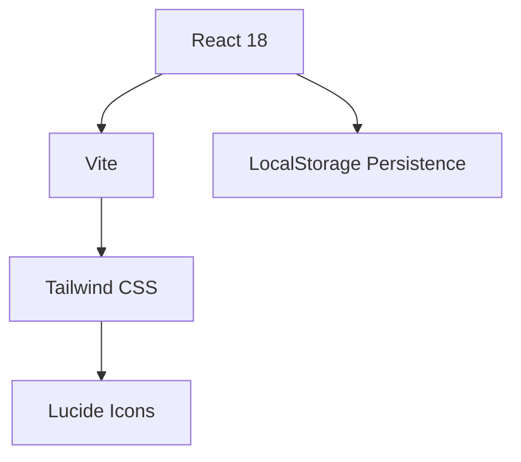

# 🌊 MySET Digital Notepad
### DIGITAL AMATEUR RADIO EMERGENCY SUITE
Powered by **9M2PJU**

 

> **A mission-critical logging companion for the Malaysian Amateur Radio Simulated Emergency Test.**  
> *Built for speed, durability, and offline field operations.*

[**🚀 Launch Mission Control**](https://setpad.hamradio.my)

  

## 💎 The Edge
| Feature | Description | Identity |
| :--- | :--- | :--- |
| **Tactical Logger** | Rapid contact entry with keyboard-first workflow. | ⚡ Speed |
| **Radiogram Engine** | Formal IARU message generation (UTC/Local) with print-ready output. | 📄 Compliance |
| **MYT Lock** | Explicit Malaysia Standard Time enforcement. | 🕒 Legal |
| **Power Guard** | Automatic power source (BATT/MAINS) tracking. | 🔋 Compliance |
| **Orbitron UI** | High-contrast neon aesthetics for low-light ops. | 🌙 Night Mode |

## 🛠️ Field Operations Guide

### 1. Deployment phase
Connect your callsign and grid square in the **Station Settings**. This identity is stamped on every log and message generated during your session.

### 2. Live Logger
Switch to **Logger** for the heat of the action. Valid frequencies and modes are pre-selectable. Hit `Send` or `Enter` to commit a contact to your local encrypted storage.

### 3. Traffic Handling
Draft formal IARU Radiograms in the **Radiogram** tab. Use **Copy Text** for digital modes (JS8Call / Fldigi) or **Print** for physical handovers.

### 4. Post-Mission Report
When the exercise concludes, one-click **Export CSV** generates a compliant report for your SET coordinator.

## 📦 Technical Specs

- **Framework**: React + Vite (Ultrafast HMR)
- **Styling**: Tailwind CSS + Orbitron Design System
- **Persistence**: 100% Client-side (No backend, Maximum Privacy)
- **Timezone**: `Asia/Kuala_Lumpur` (MYT)

## 📜 License
Mission authorized under the **MIT License**.

---

   
    
   <small>MADE WITH PRIDE FOR 🇲🇾 BY <a href="https://hamradio.my">9M2PJU</a></small>

