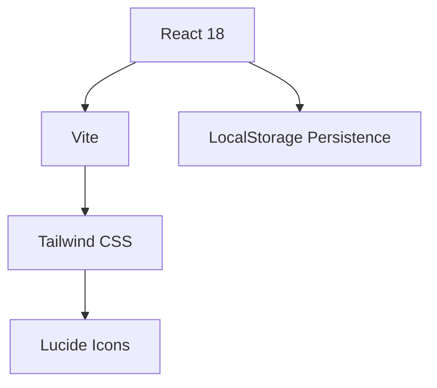

# 🌊 9M2PJU SET Pad (DARES)
### DIGITAL AMATEUR RADIO EMERGENCY SUITE
Powered by **9M2PJU**

 

> **A mission-critical tactical suite for the Malaysian Amateur Radio Simulated Emergency Test.**  
> *Built for speed, crypto-security, and offline field operations.*

[**🚀 Launch Mission Control**](https://setpad.hamradio.my)

  

## 💎 The Edge
| Feature | Description | Identity |
| :--- | :--- | :--- |
| **LOGGER** | Rapid contact entry with keyboard-first workflow. | ⚡ Speed |
| **Radiogram Engine** | Formal IARU message generation (UTC/Local) with Print/Email/PDF support. | 📄 Compliance |
| **Morse Tool (CW)** | Text-to-Morse audio playback for signal verification. | 📡 Signal |
| **Cipher Converter** | Advanced crypto (Playfair, Transposition, Caesar) for tactical traffic. | 🔐 Security |
| **Orbitron UI** | High-contrast neon aesthetics for low-light ops. | 🌙 Night Mode |

## 🛠️ Field Operations Guide

### 1. Identity phase
Connect your callsign and grid square in the **Station Config**. This identity is stamped on every log and message generated.

### 2. Signal Tools
Use the **Morse (CW)** tab for signal audio training or verification. Switch to **Cipher** for classical encryption of tactical data.

### 3. Traffic Handling
Draft formal Radiograms in the **IARU Radiogram** tab. Use **Direct Email** for quick delivery or **PDF/Print** for physical backups.

### 4. Direct Export
When the exercise concludes, one-click **Export CSV** generates a compliant report for your SET coordinator.

## 📦 Technical Specs

- **Framework**: React + Vite (Ultrafast HMR)
- **Styling**: Tailwind CSS + Orbitron Design System
- **Persistence**: 100% Client-side (No backend, Maximum Privacy)
- **Timezone**: `Asia/Kuala_Lumpur` (MYT) / UTC Toggled

## 📜 License
Mission authorized under the **MIT License**.

---

   
    
   <small>MADE WITH PRIDE FOR 🇲🇾 BY <a href="https://hamradio.my">9M2PJU</a></small>

